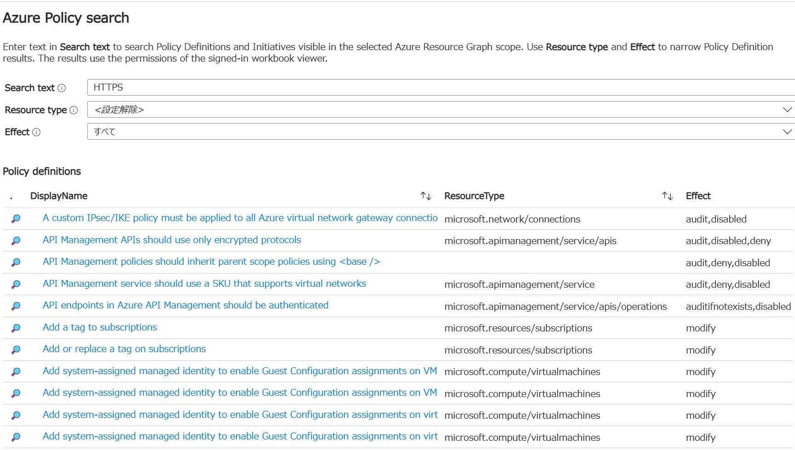

# Azure Policy Search

**Azure Policy Search** is an Azure Monitor Workbook for finding Azure Policy definitions and policy initiatives across an Azure Resource Graph scope.

It provides a focused, read-only view of policy metadata and links each result to the corresponding resource in the Azure portal.

## Features

- Search policy names, display names, descriptions, and serialized definitions.
- Filter policy definitions by resource type and effect.
- Browse policy definitions and policy initiatives in separate tables.
- Open each result directly in the Azure portal.
- Use the workbook with a tenant, subscription, or management group scope selected at runtime.

## Requirements

- Access to the Azure portal and Azure Monitor Workbooks.
- Permission to read policy metadata in the subscriptions or management groups being searched. Reader access is normally sufficient.
- Azure Resource Graph access to the selected scope.

The workbook does not contain a tenant ID, subscription ID, or other environment-specific resource ID. The search scope is selected by the user in the Azure portal at runtime.

## Import Azure Policy Search

1. Open **Azure Monitor** in the Azure portal.
2. Open **Workbooks** and select **New**.
3. In the workbook editor, select **Advanced editor** (`</>`).
4. Copy the contents of [`AzurePolicyWorkbook.workbook.json`](AzurePolicyWorkbook.workbook.json) into the editor.
5. Apply the workbook.
6. For the query items, set the Azure Resource Graph scope to **Tenant/Directory**, then select the subscriptions or management groups to search.
7. Save the workbook to the desired resource group or shared location.

The scope must be selected in the portal. No tenant or subscription ID is hard-coded in the JSON.

## Usage

1. Enter a value in **Search text**. The search checks the resource name, display name, description, and serialized definition.
2. Optionally select one or more **Resource type** values to narrow policy definition results.
3. Optionally select one or more **Effect** values to filter policy definitions.
4. Use the **Open in portal** link to open a definition or initiative in the Azure portal.

Policy definitions and initiatives whose display name contains `[Deprecated]` are excluded by default.

## Permissions

The workbook uses the signed-in viewer's Azure permissions. It does not grant access to policy definitions that the viewer cannot read. Workbook access and Azure resource permissions are separate requirements.

## Limitations

- The workbook is read-only. It does not create, edit, delete, or assign policies.
- Effect values are resolved when they are fixed values or when `allowedValues` or `defaultValue` is available. Otherwise the original parameter expression is shown.
- `ResourceType` extracts common `field = type` shapes from policy rules; it does not perform a complete recursive policy-rule traversal.
- The search text is inserted into a quoted KQL literal. Avoid using a single quote in the search text; use a shorter search fragment when necessary.
- The `PortalUrl` cell is the clickable action. Row-click events are not used.

## Repository Contents

| File | Description |
| --- | --- |
| [`AzurePolicySearch.workbook.json`](AzurePolicySearch.workbook.json) | Azure Monitor Workbook definition for Azure Policy Search |

## License

This project is licensed under the [MIT License](LICENSE).
